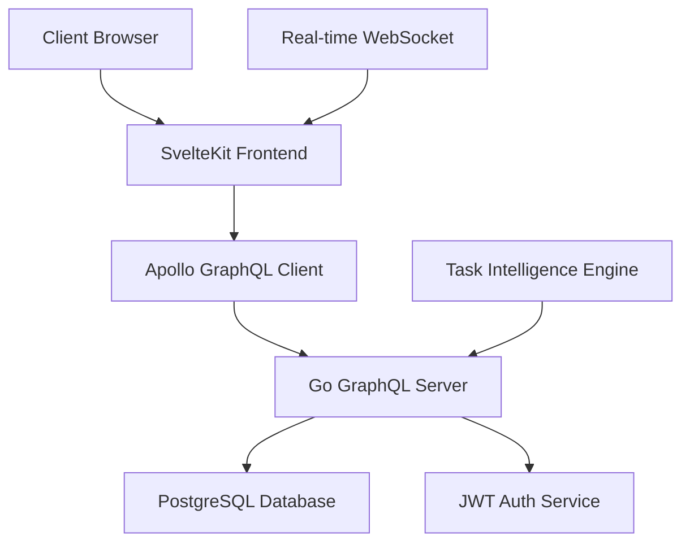

# 📋 DoTask - Intelligent Task Management System

<div align="center">


[](https://github.com/Zayan-Mohamed/DoTask)
[](https://github.com/Zayan-Mohamed/DoTask/releases)
[](LICENSE.md)
[](CONTRIBUTING.md)

**A modern, intelligent task management system built with SvelteKit and Go**

[🚀 Live Demo](https://dotask.example.com) • [📖 Documentation](https://docs.dotask.example.com) • [🐛 Report Bug](https://github.com/Zayan-Mohamed/DoTask/issues) • [💡 Request Feature](https://github.com/Zayan-Mohamed/DoTask/issues)

</div>

---

## ✨ Features

### 🎯 Core Functionality

- **📝 Smart Task Management** - Create, organize, and track tasks with intelligent categorization
- **🏷️ Dynamic Categories** - Flexible category system with color coding and custom icons
- **🔍 Advanced Search & Filtering** - Find tasks instantly with powerful search capabilities
- **📊 Priority Intelligence** - AI-powered task prioritization based on context and deadlines
- **⏰ Real-time Updates** - Live synchronization across all devices and browsers

### 🎨 User Experience

- **🌙 Dark/Light Mode** - Elegant themes that adapt to your preference
- **📱 Mobile Responsive** - Seamless experience across desktop, tablet, and mobile
- **🎭 Intuitive Interface** - Clean, modern design focused on productivity
- **⚡ Lightning Fast** - Optimized performance with instant loading
- **🔄 Offline Support** - Continue working even without internet connection

### 🔐 Security & Authentication

- **🛡️ JWT Authentication** - Secure token-based authentication system
- **👤 User Management** - Complete user registration and profile management
- **🔒 Data Protection** - End-to-end encryption for sensitive task data
- **🌐 CORS Security** - Proper cross-origin resource sharing configuration

---

## 🏗️ Architecture

### Frontend Stack

```
SvelteKit 5 + TypeScript + TailwindCSS + Apollo GraphQL
```

### Backend Stack

```
Go + GraphQL + PostgreSQL + JWT + Gin Framework
```

### System Architecture



---

## 🚀 Quick Start

### Prerequisites

Before you begin, ensure you have the following installed:

- **Node.js** (v18.0.0 or higher)
- **Go** (v1.21.0 or higher)
- **PostgreSQL** (v13.0 or higher)
- **Git**

### Installation

1. **Clone the repository**

   ```bash
   git clone https://github.com/Zayan-Mohamed/DoTask.git
   cd DoTask
   ```

2. **Setup Frontend**

   ```bash
   cd do-task
   npm install
   cp .env.example .env
   # Configure your environment variables
   npm run dev
   ```

3. **Setup Backend**

   ```bash
   cd ../do-task-backend
   go mod download
   cp .env.example .env
   # Configure your database and JWT settings
   go run main.go
   ```

4. **Database Setup**

   ```bash
   # Create PostgreSQL database
   createdb dotask_db

   # Run migrations (if available)
   go run migrate.go
   ```

### Environment Configuration

#### Frontend (.env)

```env
VITE_GRAPHQL_ENDPOINT=http://localhost:8080/graphql
VITE_WS_ENDPOINT=ws://localhost:8080/graphql
VITE_APP_TITLE=DoTask
VITE_APP_VERSION=1.0.0
```

#### Backend (.env)

```env
PORT=8080
DB_HOST=localhost
DB_PORT=5432
DB_NAME=dotask_db
DB_USER=your_username
DB_PASSWORD=your_password
JWT_SECRET=your_jwt_secret_key
CORS_ORIGINS=http://localhost:5173
```

---

## 🛠️ Development

### Frontend Development

```bash
cd do-task

# Start development server
npm run dev

# Build for production
npm run build

# Preview production build
npm run preview

# Run tests
npm run test

# Lint code
npm run lint

# Format code
npm run format
```

### Backend Development

```bash
cd do-task-backend

# Start development server with hot reload
go run main.go

# Build for production
go build -o dotask-server main.go

# Run tests
go test ./...

# Generate GraphQL schema
go run github.com/99designs/gqlgen generate
```

### Available Scripts

| Script            | Description                       |
| ----------------- | --------------------------------- |
| `npm run dev`     | Start frontend development server |
| `npm run build`   | Build frontend for production     |
| `npm run preview` | Preview production build          |
| `npm run test`    | Run frontend tests                |
| `npm run lint`    | Lint frontend code                |
| `go run main.go`  | Start backend development server  |
| `go build`        | Build backend for production      |
| `go test ./...`   | Run backend tests                 |

---

## 📡 API Documentation

### GraphQL Endpoint

```
POST http://localhost:8080/graphql
```

### Core Queries

#### Get All Tasks

```graphql
query GetTasks {
  tasks {
    id
    title
    description
    completed
    priority
    category {
      id
      name
      color
    }
    createdAt
    updatedAt
  }
}
```

#### Get Task Categories

```graphql
query GetCategories {
  categories {
    id
    name
    color
    icon
    taskCount
  }
}
```

### Core Mutations

#### Create Task

```graphql
mutation CreateTask($input: CreateTaskInput!) {
  createTask(input: $input) {
    id
    title
    description
    priority
    category {
      id
      name
    }
  }
}
```

#### Update Task

```graphql
mutation UpdateTask($id: ID!, $input: UpdateTaskInput!) {
  updateTask(id: $id, input: $input) {
    id
    title
    completed
    updatedAt
  }
}
```

### Authentication

#### Login

```graphql
mutation Login($email: String!, $password: String!) {
  login(email: $email, password: $password) {
    token
    user {
      id
      email
      name
    }
  }
}
```

#### Register

```graphql
mutation Register($input: RegisterInput!) {
  register(input: $input) {
    token
    user {
      id
      email
      name
    }
  }
}
```

---

## 🗂️ Project Structure

```
DoTask/
├── 📁 do-task/                    # Frontend (SvelteKit)
│   ├── 📁 src/
│   │   ├── 📁 lib/
│   │   │   ├── 📁 components/     # Reusable UI components
│   │   │   ├── 📁 stores/         # Svelte stores
│   │   │   ├── 📁 utils/          # Utility functions
│   │   │   └── 📁 graphql/        # GraphQL queries/mutations
│   │   ├── 📁 routes/             # SvelteKit routes
│   │   └── 📁 app.html            # Main HTML template
│   ├── 📄 package.json
│   ├── 📄 tailwind.config.js
│   └── 📄 vite.config.js
├── 📁 do-task-backend/            # Backend (Go)
│   ├── 📁 graph/
│   │   ├── 📁 model/              # GraphQL models
│   │   ├── 📁 resolver/           # GraphQL resolvers
│   │   └── 📄 schema.graphqls     # GraphQL schema
│   ├── 📁 internal/
│   │   ├── 📁 auth/               # Authentication logic
│   │   ├── 📁 database/           # Database connection
│   │   └── 📁 middleware/         # HTTP middleware
│   ├── 📄 go.mod
│   └── 📄 main.go
├── 📄 README.md
├── 📄 LICENSE.md
└── 📄 docker-compose.yml
```

---

## 🔒 Security

### Authentication & Authorization

- **JWT Token Management** - Secure token-based authentication
- **Password Hashing** - bcrypt encryption for user passwords
- **Rate Limiting** - Protection against brute force attacks
- **CORS Configuration** - Proper cross-origin request handling

### Data Protection

- **Input Validation** - Comprehensive input sanitization
- **SQL Injection Prevention** - Parameterized queries and ORM protection
- **XSS Protection** - Content Security Policy implementation
- **HTTPS Enforcement** - SSL/TLS encryption in production

### Best Practices

- Regular security audits
- Dependency vulnerability scanning
- Environment variable protection
- Secure session management

---

## ⚡ Performance

### Frontend Optimizations

- **Code Splitting** - Automatic route-based code splitting
- **Tree Shaking** - Unused code elimination
- **Image Optimization** - Responsive images with lazy loading
- **Caching Strategy** - Intelligent browser and service worker caching

### Backend Optimizations

- **GraphQL Query Optimization** - Efficient data fetching
- **Database Indexing** - Optimized query performance
- **Connection Pooling** - Efficient database connections
- **Gzip Compression** - Reduced response sizes

### Monitoring

- Performance metrics tracking
- Error monitoring and alerting
- Database query analysis
- Real-time application monitoring

---

## 🚢 Deployment

### Docker Deployment

1. **Build and run with Docker Compose**

   ```bash
   docker-compose up -d
   ```

2. **Environment Configuration**
   ```yaml
   # docker-compose.yml
   version: "3.8"
   services:
     frontend:
       build: ./do-task
       ports:
         - "3000:3000"
     backend:
       build: ./do-task-backend
       ports:
         - "8080:8080"
     database:
       image: postgres:15
       environment:
         POSTGRES_DB: dotask_db
   ```

### Production Deployment

#### Frontend (Vercel/Netlify)

```bash
npm run build
# Deploy build output to your hosting platform
```

#### Backend (Railway/Heroku/DigitalOcean)

```bash
go build -o dotask-server main.go
# Deploy binary to your hosting platform
```

### Environment Variables for Production

```env
# Frontend
VITE_GRAPHQL_ENDPOINT=https://api.yourdomain.com/graphql
VITE_WS_ENDPOINT=wss://api.yourdomain.com/graphql

# Backend
PORT=8080
DB_HOST=your-production-db-host
JWT_SECRET=your-production-jwt-secret
CORS_ORIGINS=https://yourdomain.com
```

---

## 🧪 Testing

### Frontend Testing

```bash
cd do-task

# Unit tests
npm run test:unit

# Integration tests
npm run test:integration

# E2E tests
npm run test:e2e

# Coverage report
npm run test:coverage
```

### Backend Testing

```bash
cd do-task-backend

# Unit tests
go test ./...

# Integration tests
go test -tags=integration ./...

# Benchmark tests
go test -bench=. ./...
```

### Test Coverage

- **Frontend**: 85%+ test coverage target
- **Backend**: 90%+ test coverage target
- **E2E**: Critical user flows covered

---

## 🤝 Contributing

We welcome contributions! Please see our [Contributing Guide](CONTRIBUTING.md) for details.

### Development Process

1. Fork the repository
2. Create a feature branch (`git checkout -b feature/amazing-feature`)
3. Make your changes
4. Add tests for your changes
5. Ensure all tests pass
6. Commit your changes (`git commit -m 'Add amazing feature'`)
7. Push to the branch (`git push origin feature/amazing-feature`)
8. Open a Pull Request

### Code Style

- **Frontend**: ESLint + Prettier configuration
- **Backend**: Go fmt + golangci-lint
- **Commits**: Conventional Commits specification

---

## 🗺️ Roadmap

### Version 2.0 (Q2 2024)

- [ ] 🤖 AI-powered task suggestions
- [ ] 📊 Advanced analytics dashboard
- [ ] 🔗 Third-party integrations (Slack, Teams, etc.)
- [ ] 📱 Mobile app (React Native)

### Version 2.1 (Q3 2024)

- [ ] 👥 Team collaboration features
- [ ] 🔄 Task automation workflows
- [ ] 📈 Advanced reporting
- [ ] 🌍 Multi-language support

### Version 3.0 (Q4 2024)

- [ ] 🧠 Machine learning task optimization
- [ ] 🎯 Advanced project management
- [ ] 📊 Business intelligence features
- [ ] 🔌 Plugin architecture

---

## ❓ Troubleshooting

### Common Issues

#### Frontend Issues

**Problem**: `npm install` fails

```bash
# Solution: Clear cache and reinstall
npm cache clean --force
rm -rf node_modules package-lock.json
npm install
```

**Problem**: Build errors with TailwindCSS

```bash
# Solution: Rebuild TailwindCSS
npm run build:css
```

#### Backend Issues

**Problem**: Database connection fails

```bash
# Check PostgreSQL status
sudo systemctl status postgresql

# Verify connection settings
psql -h localhost -U username -d dotask_db
```

**Problem**: GraphQL schema errors

```bash
# Regenerate GraphQL code
go run github.com/99designs/gqlgen generate
```

### Getting Help

- 📖 Check the [Documentation](https://docs.dotask.example.com)
- 🐛 Report bugs in [Issues](https://github.com/Zayan-Mohamed/DoTask/issues)
- 💬 Join our [Discord Community](https://discord.gg/dotask)
- 📧 Email us at [support@dotask.example.com](mailto:support@dotask.example.com)

---

## 📄 License

This project is licensed under the MIT License - see the [LICENSE.md](LICENSE.md) file for details.

---

## 🙏 Acknowledgments

- **SvelteKit Team** - For the amazing frontend framework
- **Go Community** - For the powerful backend language
- **GraphQL** - For the flexible API query language
- **TailwindCSS** - For the utility-first CSS framework
- **All Contributors** - Thank you for making DoTask better!

---

## 📊 Project Stats


---

<div align="center">

**Built with ❤️ by [Zayan Mohamed](https://github.com/Zayan-Mohamed)**

**If you found this project helpful, please give it a ⭐**

</div>
